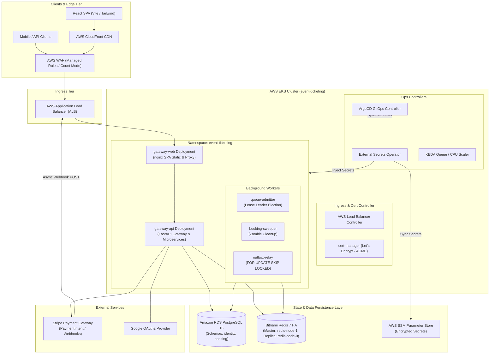
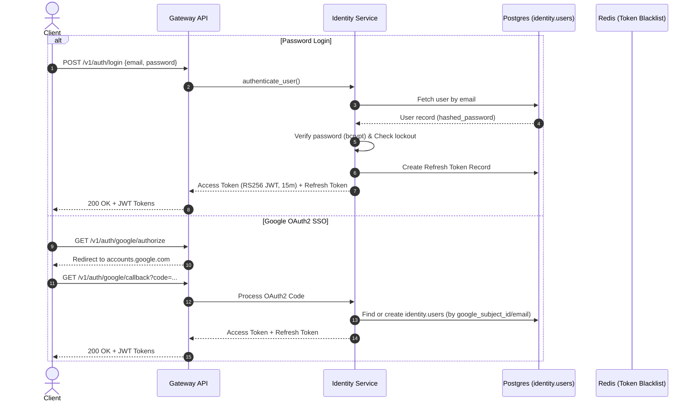
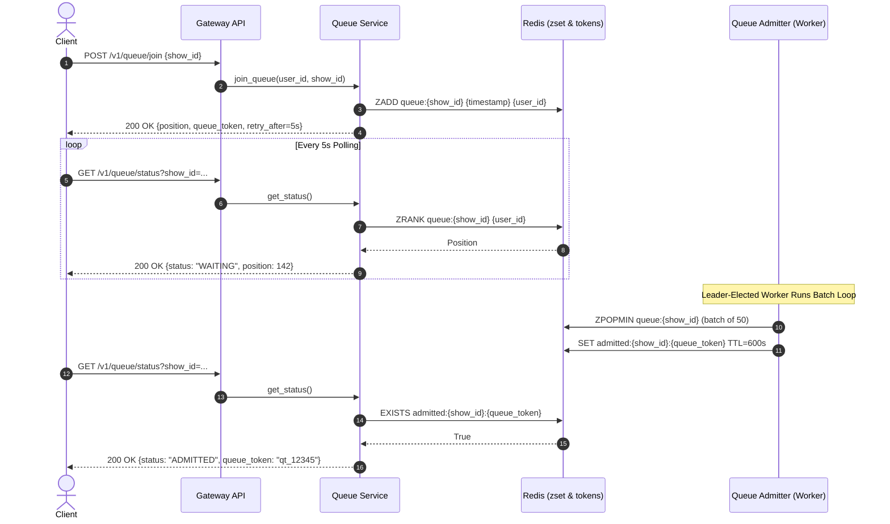
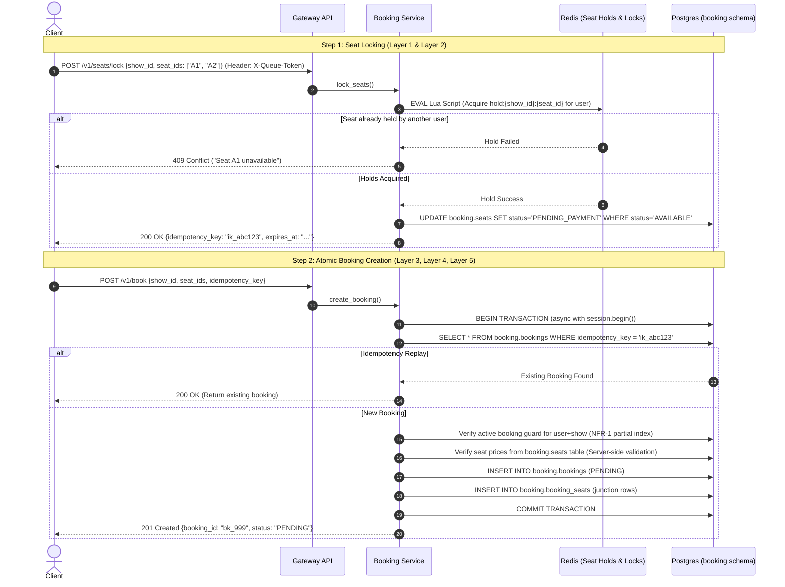
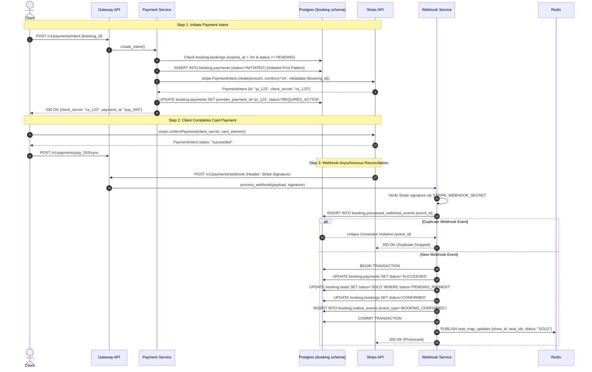
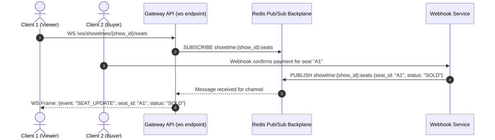

# High-Level Design (HLD) — Event Ticketing System

## 1. Executive Summary & Architectural Principles

The **Event Ticketing System** is a distributed, high-concurrency event ticketing platform built specifically for high-demand "flash-sale" scenarios (e.g., major concert tours, sports championships). During peak sales, thousands of users request seat locks simultaneously within seconds, creating extreme database contention, potential double-bookings, and payment gateway bottlenecks.

### Core Architectural Principles
1. **Zero Double-Bookings Guarantee**: Enforced through a **5-Layer Concurrency Control Engine** (Redis hoarding locks, distributed locking, atomic database status checks, single-transaction state transitions, and background sweeper reconciliation).
2. **Strict Controller-Service-Repository (CSR) Separation**: Uncompromising boundary isolation between HTTP routing (Controllers), domain business logic (Services), and database interactions (Repositories).
3. **Transactional Outbox & Eventual Consistency**: Money and state mutations occur inside a single PostgreSQL `async with session.begin():` block. Downstream events (email, analytics, notification) are appended to a `booking.outbox_events` table within the same transaction and read asynchronously via `FOR UPDATE SKIP LOCKED`.
4. **Resilient Payment Reconciliation**: Uses an **"Initiated-Record-First"** pattern before interacting with Stripe, preventing orphaned payment intents and handling out-of-order webhook delivery idempotently.
5. **GitOps & Cloud-Native Elasticity**: Fully containerized multi-stage Docker builds deployed on AWS EKS 1.35, utilizing KEDA autoscaling, Bitnami Redis HA (Master/Replica), Amazon RDS PostgreSQL, External Secrets Operator (ESO), CloudFront CDN, AWS WAF, and ArgoCD GitOps continuous reconciliation.

---

## 2. High-Level Architecture Diagram



---

## 3. Subsystem Boundaries & Microservices

```
apps/backend/
├── core/                   # Shared Infrastructure (DB Session, Redis, Security, Exceptions, Observability)
└── services/
    ├── gateway/            # FastAPI Gateway App, Middleware (Auth, CORS, Security Headers, Rate Limit, W3C)
    ├── identity/           # Authentication, User Management, RS256 JWT, Refresh Tokens, Google OAuth2
    ├── booking/            # Catalog (Events/Showtimes/Venues), Seats, Queue (Waiting Room), Booking Core
    ├── payment/            # Stripe Client Integration, Payment Service, Webhook Reconciliation Service
    └── workers/            # In-Process / Standalone Background Workers (Admitter, Sweeper, Outbox Relay)
```

### 3.1 Gateway API Subsystem
- **Role**: Entry point for all HTTP traffic and WebSocket connections (`/v1/*`, `/ws`).
- **Responsibilities**: Security header injection (CSP, HSTS, X-Frame-Options), W3C traceparent context propagation, RS256 JWT authentication middleware, slowapi rate limiting (public, auth, and booking tiers), and CORS enforcement.

### 3.2 Identity & Security Subsystem
- **Role**: Identity lifecycle management and token issuance (`identity` schema).
- **Responsibilities**:
  - Email/Password signup with `zxcvbn` strength scoring and progressive login lockout.
  - Google OAuth2 Authorization Code flow with automatic account linking by email.
  - RS256 JWT issuance (`access_token` with 15-min TTL, `jti` claim) and DB-backed refresh tokens with automatic reuse detection (invalidates entire token family if stolen token is presented).
  - GDPR-compliant soft-deletion and anonymization (`/auth/me/anonymize`).

### 3.3 Catalog & Virtual Waiting Room Subsystem
- **Role**: Public event catalog and high-throughput traffic control (`booking` schema & Redis).
- **Responsibilities**:
  - Redis cache-aside catalog queries for venues, events, showtimes, and seat maps.
  - Virtual Waiting Room (`POST /queue/join`, `GET /queue/status`, `GET /queue/recover`): Redis Sorted Set (`zset`) ranking users by arrival timestamp.
  - Leader-elected Queue Admitter worker that grants `X-Queue-Token` admission slots at a controlled throughput rate.

### 3.4 Concurrency & Atomic Booking Engine
- **Role**: High-speed seat reservation and multi-seat booking initialization.
- **Responsibilities**:
  - Multi-seat reservation (`POST /seats/lock`) supporting up to 8 seats per request.
  - 10-minute Redis seat holds (`hold:{show_id}:{seat_id}`).
  - Server-generated idempotency keys.
  - Atomic booking initialization (`POST /book`) in a single PostgreSQL `async with session.begin():` block that inserts `booking.bookings` and `booking.booking_seats` rows.

### 3.5 Payment & Webhook Reconciliation Subsystem
- **Role**: Payment Intent lifecycle and Stripe webhook processing.
- **Responsibilities**:
  - `POST /payments/intent`: Checks booking expiry ($> 2$ min remaining), enforces `unique_active_payment_per_booking` partial index, and creates Stripe PaymentIntent.
  - `POST /payments/{id}/sync` & `POST /payments/webhook`: Webhook idempotency guard (`booking.processed_webhook_events`), status reconciliation, seat state finalization to `SOLD`, and outbox event dispatch.

### 3.6 Background Worker Subsystem
- **Role**: Asynchronous system maintenance and event propagation.
- **Workers**:
  - **Queue Admitter**: Kubernetes Lease-based leader election; admits batches of waiting queue tokens into active booking windows.
  - **Booking Sweeper**: Scans for `PENDING` bookings past `expires_at` timestamp; cancels bookings and releases locked seats back to `AVAILABLE`.
  - **Outbox Relay**: Queries `booking.outbox_events` via `SELECT ... FOR UPDATE SKIP LOCKED` and publishes unpublished events to external sinks or loggers.

---

## 4. End-to-End Workflows & Sequence Diagrams

### 4.1 Authentication & Session Management Workflow



---

### 4.2 Virtual Waiting Room & Admission Workflow



---

### 4.3 5-Layer Concurrency Control & Atomic Booking Workflow



---

### 4.4 Stripe PaymentIntent & Async Webhook Reconciliation Workflow



---

### 4.5 Live WebSocket Seat Map Update Workflow



---

## 5. Infrastructure, Cloud Topology & Security Model

### 5.1 AWS EKS Production Infrastructure Topology

- **AWS Region**: `us-east-1`
- **VPC Architecture**: 3 Public Subnets, 3 Private Subnets, Single NAT Gateway (Cost-optimized).
- **EKS Cluster Version**: 1.35 (Cluster Name: `event-ticketing`).
- **Node Groups**:
  - `on-demand`: `t3.small` (Infra pods: ingress controllers, external-secrets, metrics-server).
  - `spot`: `t3.medium` / `t4g.medium` (Application pods: gateway-api, gateway-web, workers).
- **Database (RDS)**: PostgreSQL 16 (`db.t4g.micro`, single-AZ, encrypted storage, security group restricted to EKS node security group).
- **Cache (Redis)**: Bitnami Redis Helm chart (`redis-node-1` Master, `redis-node-0` Replica, password authenticated, pinned master Service `redis-master`).

### 5.2 Security Architecture & Controls

| Security Domain | Implementation Specification |
| :--- | :--- |
| **IAM / IRSA** | IAM Roles for Service Accounts. EKS Service Accounts bind to AWS IAM roles for SSM Parameter Store read access. |
| **Secrets Management** | AWS SSM Parameter Store $\rightarrow$ External Secrets Operator (ESO) $\rightarrow$ Kubernetes Secret (`event-ticketing-secrets`). |
| **JWT Key Security** | RSA-2048 keys generated dynamically at pod startup by `entrypoint.sh` or injected via `JWT_PRIVATE_KEY` / `JWT_PUBLIC_KEY` env vars. Keys are never baked into Docker images. |
| **WAF Protection** | AWS WAF Web ACL attached to ALB with AWS Managed Rules (Core Rule Set, Known Bad Inputs, SQLi protection) operating in **Count** mode. |
| **Security Headers** | Injected in both Nginx (`nginx.conf`) and FastAPI Middleware: Content-Security-Policy (CSP), HSTS, X-Frame-Options (`DENY`), X-Content-Type-Options (`nosniff`), Referrer-Policy (`strict-origin-when-cross-origin`). |
| **Network Isolation** | Kubernetes NetworkPolicies restricting pod-to-pod communication (`allow-gateway-only`, `gateway-external-access`). |

---

## 6. Resilience, High Availability & Disaster Recovery

1. **Pod Disruption Budgets (PDBs)**: Configured for all core deployments (`gateway-api-pdb`, `gateway-web-pdb`, `sweeper-pdb`, `relay-pdb`, `admitter-pdb`) ensuring minimum availability during node drains or spot replacements.
2. **Spot Draining**: `eks/node-termination-handler` intercepts EC2 Spot Interruption notices 2 minutes prior to termination, triggering graceful pod eviction.
3. **Queue Scaler & CPU HPA**:
   - `gateway-api-hpa` & `gateway-web-hpa`: CPU/Memory autoscaling via Kubernetes HPA.
   - `keda-queue-scaler`: ScaledObject driving application replica count based on Redis waiting room queue depth.
4. **Outbox Pattern Guarantee**: If downstream notification/event services crash, no messages are lost; events remain in `booking.outbox_events` with `published_at = NULL` and are retried indefinitely by `outbox-relay`.
5. **Sweeper Auto-Reconciliation**: If a user abandons checkout or the browser crashes after locking seats, `booking-sweeper` automatically releases the seats and marks the booking as `FAILED` within 10 minutes.
