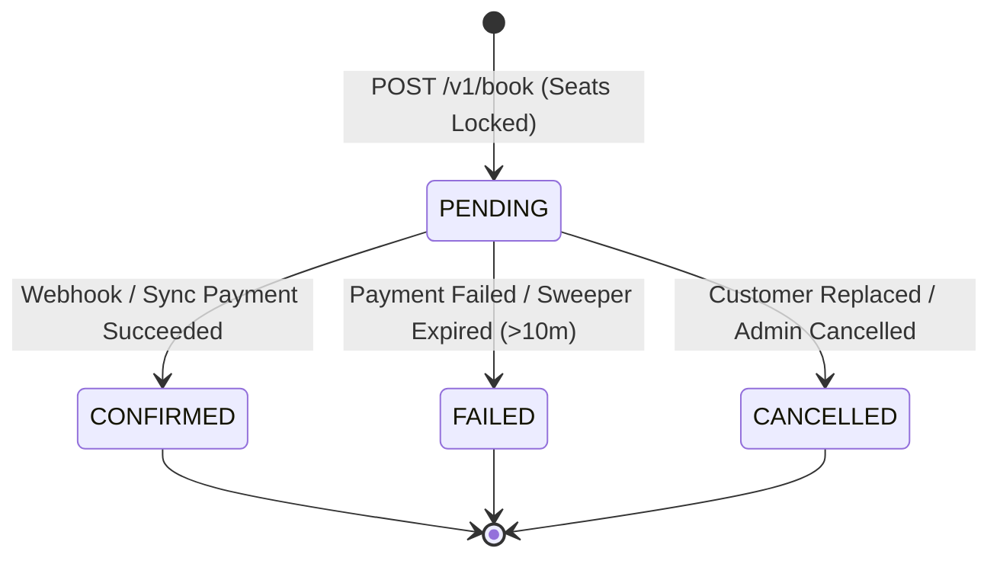
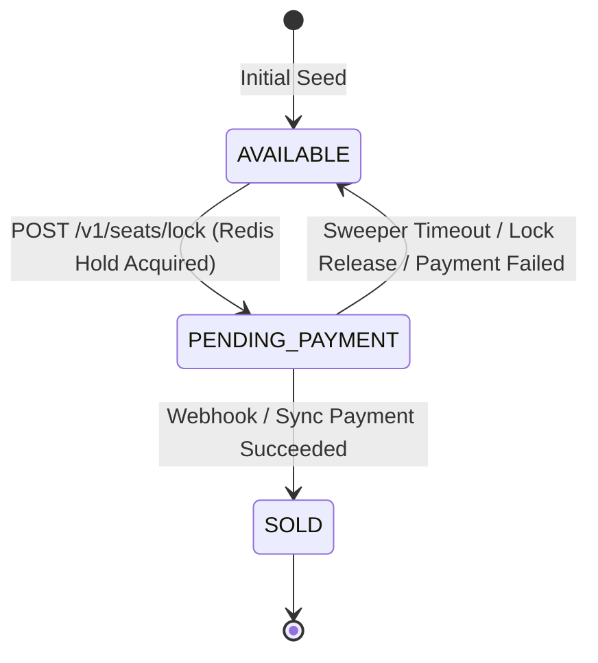
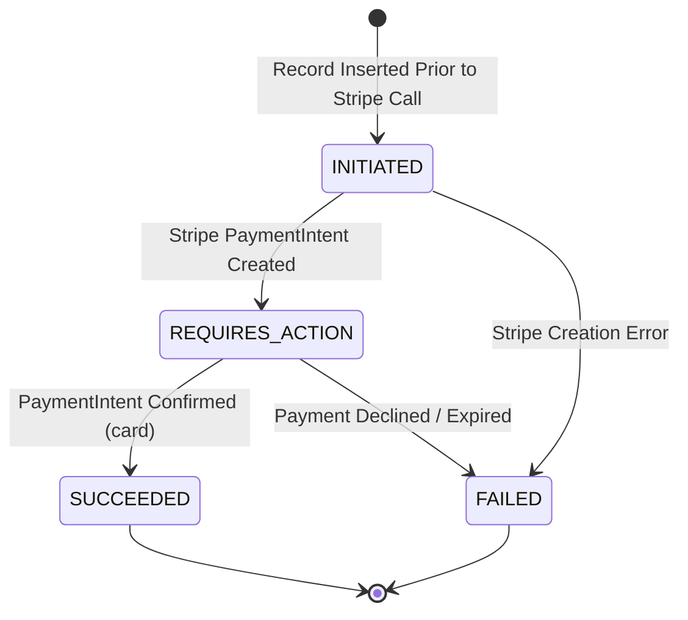

# Low-Level Design (LLD) — Event Ticketing System

## 1. Monorepo & Package Architecture

The system strictly adheres to the **Controller-Service-Repository (CSR)** pattern. Each domain module encapsulates its own routes (Controllers), business logic (Services), and database interactions (Repositories).

```
apps/backend/
├── alembic.ini             # Database migration configuration
├── entrypoint.sh           # Docker entrypoint (RSA key gen, Alembic upgrade, Gunicorn)
├── pyproject.toml          # Dependencies, packaging, pytest configuration
├── seed.py                 # Idempotent DB seeder (events, venues, showtimes, admin user)
├── core/                   # Infrastructure Core
│   ├── config.py           # Pydantic BaseSettings (env parsing & validation)
│   ├── db/
│   │   ├── base.py         # SQLAlchemy DeclarativeBase
│   │   └── session.py      # Async Engine, Session Factory, search_path hook
│   ├── enums.py            # Domain Enums (BookingStatus, SeatStatus, PaymentStatus, UserRole)
│   ├── exceptions/         # Domain Exception Hierarchy
│   ├── logging.py          # Structlog JSON/Console configuration
│   ├── middleware/         # Security headers, auth context, slowapi rate limiter
│   └── security.py         # Passlib (bcrypt), PyJWT (RS256 token encoding/decoding)
├── services/               # Microservice Modules
│   ├── gateway/            # Router aggregates, health check endpoints, WS router
│   ├── identity/           # User & Auth Domain
│   │   ├── models/         # User, RefreshToken models
│   │   ├── repositories/   # UserRepository, AuthRepository
│   │   ├── router.py       # /auth/signup, /auth/login, /auth/google/*
│   │   └── services/       # AuthService, OAuthService
│   ├── booking/            # Booking Engine Domain
│   │   ├── models/         # Venue, Event, Showtime, Seat, Booking, BookingSeat, OutboxEvent, ProcessedWebhookEvent
│   │   ├── repositories/   # VenueRepo, EventRepo, ShowtimeRepo, SeatRepo, BookingRepo, CacheRepo
│   │   ├── router.py       # /venues, /events, /showtimes, /seats/lock, /book, /queue/*
│   │   └── services/       # BookingService, QueueService, CatalogService
│   ├── payment/            # Payment & Webhook Domain
│   │   ├── providers/      # StripeClient wrapper
│   │   ├── repositories/   # PaymentRepo
│   │   ├── router.py       # /payments/intent, /payments/{id}/sync, /payments/webhook
│   │   └── services/       # PaymentService, WebhookService
│   └── workers/            # Background Workers
│       ├── admitter.py     # Queue Admitter (Lease Leader Election)
│       ├── sweeper.py      # Zombie Booking Sweeper
│       └── relay.py        # Transactional Outbox Relay
└── tests/                  # Pytest Unit & Integration Suite
```

---

## 2. Database Schema Specifications & Entity Relationships

The PostgreSQL database is organized into two primary schemas: `identity` and `booking`. Note: Foreign key constraints between schemas have been decoupled (e.g. `booking.bookings.user_id` stores an unconstrained UUID reference) to allow true independent microservice database scaling.

```mermaid
erDiagram
    identity_users ||--o{ identity_refresh_tokens : owns
    identity_users ..--o{ booking_bookings : "references (logical UUID)"
    
    booking_venues ||--o{ booking_events : hosts
    booking_events ||--o{ booking_showtimes : includes
    booking_showtimes ||--o{ booking_seats : contains
    
    booking_bookings ||--o{ booking_booking_seats : contains
    booking_seats ||--o{ booking_booking_seats : references
    
    booking_bookings ||--o{ booking_payments : has
    booking_bookings ||--o{ booking_events_log : audits
```

### 2.1 Schema: `identity`

#### `identity.users`
| Column | Type | Constraints | Description |
| :--- | :--- | :--- | :--- |
| `user_id` | UUID | Primary Key, default `gen_random_uuid()` | Unique user identifier |
| `email` | VARCHAR(255) | Unique, Not Null | User email address |
| `password_hash` | VARCHAR(255) | Nullable | Bcrypt hash (null for OAuth-only users) |
| `full_name` | VARCHAR(255) | Nullable | User display name |
| `is_admin` | BOOLEAN | Not Null, Default `false` | Master admin privilege flag |
| `google_subject_id` | VARCHAR(255) | Unique, Nullable | Google OAuth2 subject ID |
| `failed_login_attempts` | INT | Not Null, Default `0` | Lockout counter |
| `locked_until` | TIMESTAMPTZ | Nullable | Progressive lockout timestamp |
| `is_active` | BOOLEAN | Not Null, Default `true` | Account active flag |
| `anonymized_at` | TIMESTAMPTZ | Nullable | GDPR soft-delete / anonymization timestamp |
| `created_at` | TIMESTAMPTZ | Not Null, Default `now()` | Record creation timestamp |
| `updated_at` | TIMESTAMPTZ | Not Null, Default `now()` | Record modification timestamp |

#### `identity.refresh_tokens`
| Column | Type | Constraints | Description |
| :--- | :--- | :--- | :--- |
| `token_id` | UUID | Primary Key, default `gen_random_uuid()` | Unique token identifier |
| `user_id` | UUID | FK `identity.users(user_id)` ON DELETE CASCADE | Target user |
| `token_hash` | VARCHAR(255) | Unique, Not Null | SHA-256 hash of raw refresh token |
| `jti` | VARCHAR(255) | Unique, Not Null | JWT ID claim matching access token |
| `rotated_from` | UUID | FK `identity.refresh_tokens(token_id)` | Lineage link for reuse detection |
| `is_revoked` | BOOLEAN | Not Null, Default `false` | Manual / automatic revocation flag |
| `expires_at` | TIMESTAMPTZ | Not Null | Token expiration timestamp (7 days) |
| `created_at` | TIMESTAMPTZ | Not Null, Default `now()` | Issuance timestamp |

---

### 2.2 Schema: `booking`

#### `booking.venues`
| Column | Type | Constraints | Description |
| :--- | :--- | :--- | :--- |
| `venue_id` | UUID | Primary Key | Venue identifier |
| `name` | VARCHAR(255) | Not Null | Venue name |
| `address` | TEXT | Not Null | Physical location |
| `total_seats` | INT | Not Null | Total capacity |
| `created_by` | UUID | FK `identity.users(user_id)` | Admin creator ID |

#### `booking.events`
| Column | Type | Constraints | Description |
| :--- | :--- | :--- | :--- |
| `event_id` | UUID | Primary Key | Event identifier |
| `venue_id` | UUID | FK `booking.venues(venue_id)` ON DELETE CASCADE | Associated venue |
| `name` | VARCHAR(255) | Not Null | Event title |
| `description` | TEXT | Nullable | Event description |
| `category` | VARCHAR(100) | Not Null | Category (e.g. Concert, Movie) |
| `created_by` | UUID | FK `identity.users(user_id)` | Merchant / Admin owner |

#### `booking.showtimes`
| Column | Type | Constraints | Description |
| :--- | :--- | :--- | :--- |
| `show_id` | UUID | Primary Key | Showtime identifier |
| `event_id` | UUID | FK `booking.events(event_id)` ON DELETE CASCADE | Associated event |
| `venue_id` | UUID | FK `booking.venues(venue_id)` ON DELETE CASCADE | Venue location |
| `start_time` | TIMESTAMPTZ | Not Null | Showtime start time |
| `end_time` | TIMESTAMPTZ | Not Null | Showtime end time |
| `base_price` | NUMERIC(10,2)| Not Null | Base price per seat |

#### `booking.seats`
| Column | Type | Constraints | Description |
| :--- | :--- | :--- | :--- |
| `show_id` | UUID | Primary Key 1, FK `booking.showtimes` | Associated showtime |
| `seat_id` | VARCHAR(10) | Primary Key 2 | Seat coordinate (e.g. "A1") |
| `tier` | VARCHAR(50) | Not Null, Default `'VIP'` | Tier designation (VIP, Standard) |
| `price` | NUMERIC(10,2)| Not Null | Calculated seat price |
| `status` | Enum (`SeatStatus`)| Not Null, Default `'AVAILABLE'` | Enum: `AVAILABLE`, `PENDING_PAYMENT`, `SOLD` |

#### `booking.bookings`
| Column | Type | Constraints | Description |
| :--- | :--- | :--- | :--- |
| `booking_id` | UUID | Primary Key | Booking identifier |
| `user_id` | UUID | FK `identity.users(user_id)` | Customer ID |
| `show_id` | UUID | Not Null | Showtime ID |
| `seat_id` | VARCHAR(10) | Nullable | Single-seat legacy reference |
| `status` | Enum (`BookingStatus`) | Not Null, Default `'PENDING'` | Enum: `PENDING`, `CONFIRMED`, `FAILED`, `CANCELLED` |
| `idempotency_key` | VARCHAR(255) | Unique, Not Null | Server-generated idempotency key |
| `amount` | NUMERIC(10,2)| Not Null | Total order amount |
| `currency` | VARCHAR(3) | Not Null, Default `'inr'` | ISO 4217 Currency Code (`inr`) |
| `expires_at` | TIMESTAMPTZ | Not Null | Payment window expiry (10 minutes) |

> **Partial Index `idx_active_booking_user_show`**:
> `CREATE UNIQUE INDEX idx_active_booking_user_show ON booking.bookings (user_id, show_id) WHERE status IN ('PENDING', 'CONFIRMED');`
> Prevents a user from creating multiple concurrent active bookings for the same show (NFR-1).

#### `booking.booking_seats` (Junction Table for Multi-Seat Booking)
| Column | Type | Constraints | Description |
| :--- | :--- | :--- | :--- |
| `booking_id` | UUID | Primary Key 1, FK `booking.bookings` ON DELETE CASCADE | Associated booking |
| `seat_id` | VARCHAR(10) | Primary Key 2 | Seat coordinate |
| `show_id` | UUID | Not Null | Associated showtime |
| `price` | NUMERIC(10,2)| Not Null | Locked seat price |

#### `booking.payments`
| Column | Type | Constraints | Description |
| :--- | :--- | :--- | :--- |
| `payment_id` | UUID | Primary Key | Payment record ID |
| `booking_id` | UUID | FK `booking.bookings(booking_id)` ON DELETE RESTRICT | Target booking ID |
| `provider` | VARCHAR(50) | Not Null, Default `'stripe'` | Payment gateway provider |
| `provider_payment_id`| VARCHAR(255) | Nullable | Stripe PaymentIntent ID (`pi_...`) |
| `amount` | NUMERIC(10,2)| Not Null | Charge amount |
| `status` | Enum (`PaymentStatus`) | Not Null, Default `'INITIATED'` | Enum: `INITIATED`, `REQUIRES_ACTION`, `SUCCEEDED`, `FAILED`, `CANCELLED` |

> **Partial Index `idx_unique_active_payment_per_booking`**:
> `CREATE UNIQUE INDEX idx_unique_active_payment_per_booking ON booking.payments (booking_id) WHERE status IN ('INITIATED', 'REQUIRES_ACTION');`
> Enforces that repeated intent requests for a pending booking reuse the existing intent (FR-5).

#### `booking.outbox_events`
| Column | Type | Constraints | Description |
| :--- | :--- | :--- | :--- |
| `event_id` | UUID | Primary Key, default `gen_random_uuid()` | Event ID |
| `aggregate_type` | VARCHAR(100) | Not Null | Aggregate entity name (`booking`) |
| `aggregate_id` | UUID | Not Null | Aggregate entity ID (`booking_id`) |
| `event_type` | VARCHAR(100) | Not Null | Domain event (e.g. `BOOKING_CONFIRMED`) |
| `payload` | JSONB | Not Null | Event data |
| `published_at` | TIMESTAMPTZ | Nullable | Outbox dispatch timestamp |

#### `booking.processed_webhook_events`
| Column | Type | Constraints | Description |
| :--- | :--- | :--- | :--- |
| `event_id` | VARCHAR(255) | Primary Key | Stripe webhook event ID (`evt_...`) |
| `event_type` | VARCHAR(100) | Not Null | Stripe event type (`payment_intent.succeeded`) |
| `payload` | JSONB | Not Null | Raw payload |

---

## 3. Formal State Machines

### 3.1 Booking State Machine (`BookingStatus`)



### 3.2 Seat State Machine (`SeatStatus`)



### 3.3 Payment State Machine (`PaymentStatus`)



---

## 4. API Endpoints & Request/Response Contracts

### 4.1 Authentication Endpoints

#### `POST /v1/auth/signup`
- **Request Body**:
  ```json
  {
    "email": "user@example.com",
    "password": "StrongPassword123!",
    "full_name": "Jane Doe"
  }
  ```
- **Response `201 Created`**:
  ```json
  {
    "user_id": "8f34890d-f271-40ff-249b-a4f8fc3ec9b4",
    "email": "user@example.com",
    "full_name": "Jane Doe",
    "is_admin": false
  }
  ```

#### `POST /v1/auth/login`
- **Request Body**:
  ```json
  {
    "email": "user@example.com",
    "password": "StrongPassword123!"
  }
  ```
- **Response `200 OK`**:
  ```json
  {
    "access_token": "eyJhbGciOiJSUzI1NiIs...",
    "refresh_token": "rt_87df6...",
    "token_type": "bearer",
    "expires_in": 900
  }
  ```

---

### 4.2 Queue & Concurrency Endpoints

#### `POST /v1/seats/lock`
- **Headers**: `Authorization: Bearer <jwt>`, `X-Queue-Token: <token>`
- **Request Body**:
  ```json
  {
    "show_id": "e9150818-48ec-44e5-827f-1fc18c96928e",
    "seat_ids": ["A1", "A2"]
  }
  ```
- **Response `200 OK`**:
  ```json
  {
    "idempotency_key": "ik_74566fcc4f",
    "expires_at": "2026-08-05T22:15:00Z",
    "seat_prices": [
      {"seat_id": "A1", "price": "150.00", "tier": "VIP"},
      {"seat_id": "A2", "price": "150.00", "tier": "VIP"}
    ],
    "total_price": "300.00"
  }
  ```

#### `POST /v1/book`
- **Headers**: `Authorization: Bearer <jwt>`, `X-Queue-Token: <token>`
- **Request Body**:
  ```json
  {
    "show_id": "e9150818-48ec-44e5-827f-1fc18c96928e",
    "seat_ids": ["A1", "A2"],
    "idempotency_key": "ik_74566fcc4f"
  }
  ```
- **Response `201 Created`**:
  ```json
  {
    "booking_id": "bcf662e6-bb10-49cb-b70c-93d6345510e6",
    "status": "PENDING",
    "amount": "300.00",
    "currency": "inr",
    "expires_at": "2026-08-05T22:15:00Z"
  }
  ```

---

### 4.3 Payment Endpoints

#### `POST /v1/payments/intent`
- **Request Body**: `{"booking_id": "bcf662e6-bb10-49cb-b70c-93d6345510e6"}`
- **Response `200 OK`**:
  ```json
  {
    "payment_id": "da91984a-2443-4899-a3a5-54e9a0426ef3",
    "client_secret": "pi_3MtwW2LkdIw..._secret_...",
    "amount": "300.00",
    "currency": "inr"
  }
  ```

#### `POST /v1/payments/{payment_id}/sync`
- **Response `200 OK`**:
  ```json
  {
    "payment_id": "da91984a-2443-4899-a3a5-54e9a0426ef3",
    "payment_status": "succeeded",
    "booking_id": "bcf662e6-bb10-49cb-b70c-93d6345510e6",
    "booking_status": "CONFIRMED"
  }
  ```

---

## 5. Redis Key Specs & Lua Concurrency Scripts

### 5.1 Redis Key Naming Patterns

| Key Pattern | Data Type | TTL | Purpose |
| :--- | :--- | :--- | :--- |
| `hold:{show_id}:{seat_id}` | String | 600s (10m) | Holds seat for specific user during checkout |
| `idempotency:lock:{key}` | String | 60s | Distributed lock preventing concurrent duplicate POST /book |
| `queue:{show_id}` | Sorted Set (`zset`)| None | Virtual waiting room queue (score = arrival timestamp) |
| `admitted:{show_id}:{token}`| String | 600s (10m) | Admission token grant marker |
| `cache:catalog:venues` | String (JSON) | 300s (5m) | Redis cache-aside for venue listings |
| `cache:catalog:events` | String (JSON) | 300s (5m) | Redis cache-aside for event catalog |

---

### 5.2 Seat Hold Lua Script (`lock_seats.lua`)

```lua
-- KEYS: seat hold keys (e.g. hold:show_id:A1, hold:show_id:A2)
-- ARGV: user_id, ttl_seconds (600)
for i, key in ipairs(KEYS) do
    local current = redis.call('GET', key)
    if current and current ~= ARGV[1] then
        return {0, key} -- Fail: held by another user
    end
end
for i, key in ipairs(KEYS) do
    redis.call('SET', key, ARGV[1], 'EX', ARGV[2])
end
return {1, "OK"} -- Success: all holds set
```

---

## 6. Domain Exception Taxonomy & HTTP Mapping

Custom domain exceptions map cleanly to standard HTTP status codes via FastAPI exception handlers:

```python
class BookingConflictError(ValueError):     # -> 409 Conflict
class SeatUnavailableError(ValueError):     # -> 409 Conflict
class InvalidTokenError(ValueError):        # -> 400 Bad Request
class PersistenceError(OSError):            # -> 500 Internal Server Error
class NotFoundError(LookupError):           # -> 404 Not Found
class PaymentProviderError(OSError):        # -> 502 Bad Gateway
class WeakPasswordError(ValueError):        # -> 400 Bad Request
class RedisUnavailableError(OSError):       # -> 503 Service Unavailable
```

---

## 7. Infrastructure Topology & Cost-Optimization Specification

| Parameter | Demonstration / Staging | Multi-AZ Production HA | Rationale & Cost Trade-off |
| :--- | :--- | :--- | :--- |
| **NAT Gateways** | 1 (Single AZ) | 3 (1 per AZ) | Saves **+$64.80/mo** in fixed hourly fees; honors **$150/mo AWS Budget cap** (`budgets.tf`) |
| **PostgreSQL RDS** | `db.t4g.micro` (Single-AZ) | `db.t4g.micro` / `db.t4g.small` (Multi-AZ) | Saves **+$13.80/mo**; Multi-AZ can be enabled instantly via `multi_az = true` in `rds.tf` |
| **Functional Parity** | 100% Identical API & Code | 100% Identical API & Code | Zero code/API changes required between environments |

